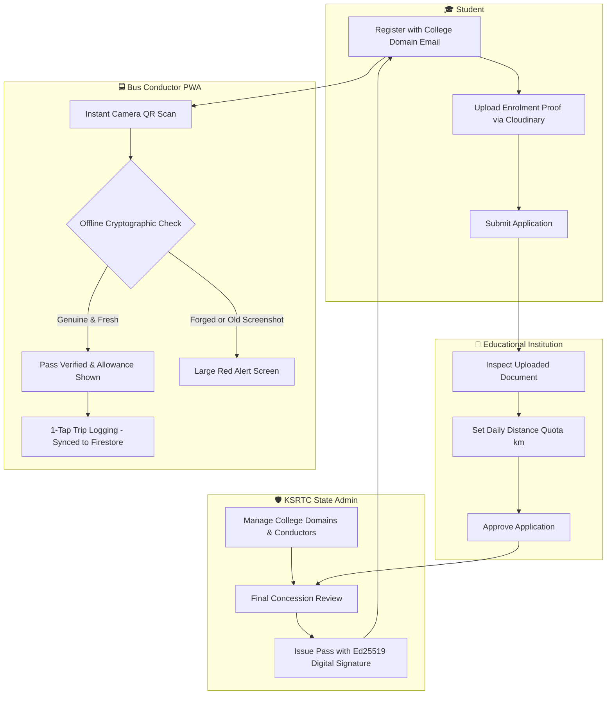

# ANAVANDI — KSRTC Digital Student Concession Pass

> **A secure, offline-capable digital student concession pass system for the Kerala State Road Transport Corporation (KSRTC)**, featuring asymmetric cryptographic signing (Ed25519), anti-screenshot daily rotating QR tokens, Cloudinary direct upload, and an offline-first PWA for bus conductors.

---

## 🚌 Overview

**ANAVANDI** replaces cumbersome paper student bus passes with a modern, fraud-proof digital wallet pass ecosystem. Built with a warm editorial aesthetic tailored for high-speed operation, the platform connects students, educational institutions, KSRTC depot administrators, and on-board bus conductors in real time.



---

## ✨ Key Features & Portals

### 1. 🎓 Student Wallet Portal (`/student`)
* **Interactive Digital Pass**: Styled as a physical wallet card with student photo, validity window, approved route stops, and dynamic QR code.
* **Anti-Screenshot Rotating QR**: Recomputes a daily HMAC-SHA256 token every 24 hours. Static screenshots fail verification on subsequent days.
* **Application Progress Tracker**: 3-stage visual timeline (`Pending Institution` → `Pending KSRTC Admin` → `Approved / Active`).
* **Usage & Distance Allowance Gauge**: Live visualization of daily distance used vs. approved institution quota.
* **Trip History Log**: Chronological record of conductor scans and bus routes.
* **1-Click Renewal**: Pre-fills existing details when pass is within 14 days of expiration.

### 2. 🏫 Institution Verification Desk (`/institution`)
* **Domain-Gated Queue**: Institutions only see applications from their verified domain (e.g., `@gecbh.ac.in`, `@cet.ac.in`).
* **Document Inspector**: Direct preview of student ID cards and fee receipts uploaded to Cloudinary.
* **Distance Quota Setting**: Assigns daily travel limits in kilometers based on verified student commute.
* **Quick Approve / Reject**: Fast workflow with optional rejection reason communicated directly to the student.

### 3. 🛡️ KSRTC State Admin Dashboard (`/admin`)
* **Institution Management**: Onboard and activate/deactivate approved educational institutions and allowed email domains.
* **Conductor Management**: Provision conductor verifier accounts by depot with instant status toggles.
* **Cryptographic Pass Issuance**: Triggers asymmetric Ed25519 digital signing and embeds the unique rotation seed into Firestore.

### 4. 🚍 Conductor Verifier PWA (`/conductor`)
* **100% Offline-Capable**: Works inside moving buses with zero network connectivity using cached service workers.
* **High-Speed Camera Scanner**: Powered by `html5-qrcode` with fullscreen scan target.
* **Sub-500ms Instant Decision Screens**: High-contrast green (verified) and red (counterfeit/stale) displays designed for rapid inspection.
* **1-Tap Trip Logger**: Logs passenger trips with route details without typing; queues locally in IndexedDB and syncs to Firestore when connection resumes.

---

## 🔐 Cryptography & Anti-Fraud Architecture

1. **Asymmetric Ed25519 Signatures (`tweetnacl`)**:
   * Every issued pass is digitally signed using a master private key.
   * Conductor devices verify the cryptographic signature entirely client-side using the hardcoded public key—no server roundtrips or cellular network needed.
2. **Rotating Daily Code (Anti-Screenshot Forgery)**:
   * Each pass contains a secret `rotationSeed` generated at issuance.
   * The student's app computes `dailyCode = Hash(rotationSeed + YYYY-MM-DD)`.
   * When scanned, the conductor PWA verifies both the Ed25519 signature and recomputes the expected daily code. A photographed or recorded QR code from yesterday will be instantly rejected as invalid.

---

## 🚀 Instant Demo Mode

The application includes a built-in **1-Click Demo Switcher** in the top navigation bar to test all 4 roles instantly:

| Role | Pre-configured Demo Profile | Description |
| :--- | :--- | :--- |
| **Student** | Arun Kumar (`arun.kumar@gecbh.ac.in`) | Digital pass wallet, application tracking, rotating QR |
| **Institution** | Principal, GEC Barton Hill (`principal@gecbh.ac.in`) | Document verification desk & distance limit approval |
| **Admin** | KSRTC Chief Traffic Officer (`admin@ksrtc.kerala.gov.in`) | Institution directory, conductor roster, pass issuance |
| **Conductor** | Suresh Kumar (`conductor104@ksrtc.gov.in`) | Offline camera QR verifier & 1-tap trip logger |

---

## 🛠️ Tech Stack

* **Frontend**: React 19, React Router v7
* **Styling**: Tailwind CSS v4 (Custom warm editorial palette: `#FAF8F5`, `#D97757`, `#4F7942`, `#B3492F`)
* **Build Tool**: Vite 8
* **PWA & Offline**: `vite-plugin-pwa`, Workbox Service Worker
* **Cryptography**: `tweetnacl`, `tweetnacl-util` (Ed25519 asymmetric signatures)
* **QR Generation & Scanning**: `qrcode.react`, `html5-qrcode`
* **Icons**: `lucide-react`
* **Backend & Storage**: Firebase Authentication, Cloud Firestore, Cloudinary (Direct unsigned upload)

---

## 📦 Getting Started

### Prerequisites
* [Node.js](https://nodejs.org/) (v18.0.0 or higher)
* `npm` or `pnpm` or `yarn`

### 1. Clone the repository
```bash
git clone https://github.com/your-username/ksrtc-std.git
cd ksrtc-std
```

### 2. Install dependencies
```bash
npm install
```

### 3. Configure environment variables
Copy `.env.example` to `.env` and fill in your Firebase and Cloudinary credentials:
```bash
cp .env.example .env
```

```env
# Firebase Configuration
VITE_FIREBASE_API_KEY=your_firebase_api_key
VITE_FIREBASE_AUTH_DOMAIN=your_project.firebaseapp.com
VITE_FIREBASE_PROJECT_ID=your_project_id
VITE_FIREBASE_STORAGE_BUCKET=your_project.firebasestorage.app
VITE_FIREBASE_MESSAGING_SENDER_ID=your_sender_id
VITE_FIREBASE_APP_ID=your_app_id

# Cloudinary Unsigned Upload Configuration
VITE_CLOUDINARY_CLOUD_NAME=your_cloud_name
VITE_CLOUDINARY_UPLOAD_PRESET=your_unsigned_preset
```

### 4. Run development server
```bash
npm run dev
```
Open [http://localhost:5173](http://localhost:5173) in your browser.

### 5. Build for production
```bash
npm run build
npm run preview
```

---

## 🔒 Firestore Security Rules

Deploy the following rules in the [Firebase Console](https://console.firebase.google.com/):

```javascript
rules_version = '2';
service cloud.firestore {
  match /databases/{database}/documents {
    match /users/{userId} {
      allow read: if request.auth != null;
      allow write: if request.auth != null && request.auth.uid == userId;
    }
    match /applications/{appId} {
      allow read, write: if request.auth != null;
    }
    match /passes/{passId} {
      allow read, write: if request.auth != null;
    }
    match /institutions/{instId} {
      allow read: if true;
      allow write: if request.auth != null;
    }
    match /conductors/{condId} {
      allow read, write: if request.auth != null;
    }
    match /trips/{tripId} {
      allow read, write: if request.auth != null;
    }
  }
}
```

---

## 📄 License

This project is licensed under the [MIT License](LICENSE).
